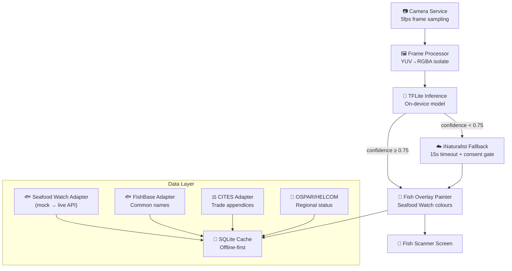

# 🌊 ecopal — Your Eco-Friendly Companion

<p align="center">
  
</p>

<p align="center">
  <a href="https://github.com/ruimcoder/ecopal/actions/workflows/ci.yml">
    
  </a>
  
  
  
</p>

---

## The Story Behind ecopal

My daughter recently graduated with an MSc in Marine Biology. She has spent years studying the ocean — the creatures in it, the fragile food webs, the irreversible consequences of overfishing. She came home one day, stood in front of a supermarket fish counter, and couldn't tell which fish were okay to buy.

The labels don't tell you. The staff don't know. The information exists — Monterey Bay Aquarium has been cataloguing it for decades — but it lives behind jargon, websites, and PDFs that nobody opens while standing in a supermarket aisle.

That conversation is what became **ecopal**.

I'm a software developer. She's a marine biologist. Together we're building the tool we wish existed: point your phone at a fish counter and instantly know whether that tuna is on the edge of collapse or whether the mackerel is a safe bet. No marine biology degree required.

We're not a company. We have no investors. We have no commercial objective beyond covering the cloud costs. We're two people who think technology should make it easier — not harder — to do the right thing.

---

## 🐟 Fish Scanner — The MVP Skill

**Point your camera at any fish counter.** ecopal identifies species in real time, drawing colour-coded bounding boxes that tell you everything you need to know at a glance:

| Colour | Rating | Meaning |
|--------|--------|---------|
| 🟢 **Green** | Best Choice | Well-managed, low environmental impact |
| 🟡 **Amber** | Good Alternative | Some concerns — buy mindfully |
| 🔴 **Red** | Avoid | Overfished or farmed in harmful ways |
| ⚫ **Grey** | Not Rated | Insufficient data for this species |

Each detection also shows:
- **Scientific name** — so you always know exactly what you're looking at
- **Common name** — in your device's language (English, Portuguese, Spanish, French, German)
- **CITES trade status** — is this species subject to international trade restrictions?
- **Regional status** — OSPAR/HELCOM flags for European waters

---

## 🏗️ Architecture at a Glance

ecopal is built as a **skill-based Flutter app** — each feature is a self-contained module. The Fish Scanner skill is the first; future skills (packaging scanner, carbon footprint, seasonal produce guide) will follow the same pattern.



**Full architecture docs:** [`docs/architecture.md`](docs/architecture.md)  
**Feature design:** [`docs/features/fish-scanner.md`](docs/features/fish-scanner.md)  
**Architecture decisions:** [`docs/adr/`](docs/adr/)

---

## 🚀 Getting Started

### Prerequisites

| Tool | Version | Install |
|------|---------|---------|
| Flutter | 3.29.2 (stable) | [flutter.dev](https://flutter.dev/docs/get-started/install) |
| Dart | ≥ 3.7.2 | Bundled with Flutter |
| Android SDK | API 26+ | Via Android Studio |
| NDK | 27.0.12077973 | Android Studio → SDK Manager → NDK |
| Java | 17 (Temurin) | [adoptium.net](https://adoptium.net) |

> **Why API 26?** The TFLite Flutter plugin requires Android API 26 (Android 8.0 Oreo) as minimum. This covers ~95% of active Android devices.

### Clone & run

```bash
# Clone the repo
git clone https://github.com/ruimcoder/ecopal.git
cd ecopal/ecopal

# Install dependencies
flutter pub get

# Connect an Android device (API 26+) or start an emulator, then:
flutter run
```

> **First run note:** The app launches in **mock mode** — no real API calls, no camera hardware required for logic testing. Mock detections show a "Thunnus thynnus (Atlantic Bluefin Tuna — AVOID)" overlay so you can see the full UI flow immediately.

### Run tests

```bash
# All tests
flutter test

# With coverage
flutter test --coverage
genhtml coverage/lcov.info -o coverage/html

# Single file
flutter test test/features/fish_scanner/painters/fish_overlay_painter_test.dart
```

### Static analysis

```bash
flutter analyze --fatal-warnings
```

---

## 📁 Project Structure

```
lib/
├── main.dart
├── core/                          # Shared utilities, theme, routing
├── features/
│   └── fish_scanner/              # MVP skill — Fish Scanner
│       ├── adapters/              # Seafood Watch, FishBase, CITES, OSPAR/HELCOM
│       ├── data/                  # SQLite cache DAO
│       ├── models/                # DetectionResult, SpeciesInfo, SeafoodWatchRating
│       ├── painters/              # FishOverlayPainter (CustomPainter)
│       ├── screens/               # FishScannerScreen
│       ├── services/              # CameraService, FrameProcessor, InferenceService,
│       │                          #   CloudFallbackService, ConsentService
│       └── widgets/               # RatingBadge, SpeciesInfoCard
└── l10n/                          # Localisation ARB files (EN, PT, ES, FR, DE)

assets/
├── models/                        # TFLite model (fish_classifier.tflite — WIP)
└── data/                          # Seed data JSON (OSPAR, HELCOM species lists)

docs/
├── architecture.md                # Living system architecture (Mermaid diagrams)
├── features/fish-scanner.md       # Full feature specification
└── adr/                           # Architecture Decision Records (001–004)

test/
└── features/fish_scanner/         # Mirrors lib/ structure
    ├── adapters/
    ├── data/
    ├── painters/
    ├── screens/
    └── services/
```

---

## 🔧 Tech Stack

| Layer | Technology | Why |
|-------|-----------|-----|
| **Framework** | Flutter 3.29.2 | Single codebase for Android (+ iOS later); excellent camera and ML support |
| **Language** | Dart 3.7 | Null-safe, isolate-based concurrency for frame processing |
| **On-device ML** | TFLite Flutter 0.10 | Runs inference in a Dart isolate; GPU/NNAPI delegate support |
| **Camera** | camera 0.11 | CameraX backend on Android; YUV frame stream |
| **Local DB** | sqflite 2.3 | Offline-first SQLite cache for species data |
| **Networking** | http 1.2 | Lightweight; all calls have 15s timeouts (LP-005) |
| **Connectivity** | connectivity_plus 6 | Graceful degradation to offline mode |
| **Permissions** | permission_handler 11 | Camera + network permission flows |
| **State** | Flutter built-ins | `ValueNotifier`, `StreamSubscription` — no external state library |
| **i18n** | flutter_localizations | ARB-based; EN/PT/ES/FR/DE planned |
| **CI/CD** | GitHub Actions | Analyze + test + APK build on every PR; Firebase App Distribution on merge to main |

---

## 🌐 Data Sources

ecopal integrates multiple conservation databases to give the most accurate picture:

| Source | What it provides | Status |
|--------|-----------------|--------|
| [Seafood Watch](https://www.seafoodwatch.org) (Monterey Bay Aquarium) | Primary sustainability rating (Best Choice / Good Alternative / Avoid) | Mock mode — awaiting license |
| [FishBase](https://fishbase.org) | Common names in 300+ languages, taxonomy | ✅ Active (open data) |
| [CITES Species+](https://speciesplus.net) | International trade appendices (I/II/III) | Mock mode — awaiting API access |
| [OSPAR Commission](https://www.ospar.org) | Regional threat status for NE Atlantic species | ✅ Active (static dataset) |
| [HELCOM](https://helcom.fi) | Regional threat status for Baltic Sea species | ✅ Active (static dataset) |
| [iNaturalist](https://www.inaturalist.org) | Computer Vision API — cloud fallback identification | ✅ Active (consent-gated) |

> 🔒 **Privacy:** The iNaturalist fallback only activates with explicit user consent, and only when on-device confidence is below 0.75. No frames are transmitted without consent.

---

## 🤝 Contributing

We'd love your help. Whether you're a Flutter developer, a marine biologist, a UX designer, or someone who just cares about the ocean — there's a place for you here.

### Good first issues

Browse issues labelled [`good first issue`](https://github.com/ruimcoder/ecopal/labels/good%20first%20issue) — these are well-scoped, documented, and don't require deep context.

### How we work

1. **Find or create an issue** — every change starts with a GitHub Issue
2. **Comment on it** — say you're picking it up so we don't duplicate effort
3. **Branch** — `feature/<issue-number>-short-description` or `fix/<issue-number>-short-description`
4. **Code** — follow the patterns in the codebase (see [`.github/copilot-instructions.md`](.github/copilot-instructions.md))
5. **PR** — reference the issue (`Closes #N`), describe what changed and how to test it

### Code standards

- `flutter analyze --fatal-warnings` must pass — zero warnings, zero errors
- All new code needs tests — we follow the structure in `test/` mirroring `lib/`
- HTTP calls must use `.timeout(const Duration(seconds: 15))` — no blocking calls
- Error handling: `on Exception catch (e)` + `debugPrint` — never `catch (_)`
- No `//` comments inside JSON files — use companion `.md` files instead

### Wave-based delivery

We deliver in parallel **waves** — groups of features that can be built concurrently. Current wave status:

| Wave | Scope | Status |
|------|-------|--------|
| 1 | Flutter scaffold, CI/CD | ✅ Done |
| 2 | Camera, SQLite cache, seed DB | ✅ Done |
| 3 | Data adapters (Seafood Watch, FishBase, CITES, OSPAR, consent) | ✅ Done |
| 4 | TFLite inference stub, Scanner UI | ✅ Done |
| 5 | Bounding-box overlay, iNaturalist fallback | ✅ Done |
| 6 | i18n, performance benchmarks, ML model training | 🔜 Next |

---

## 🗺️ Roadmap

**MVP (Fish Scanner v1.0)**
- [x] Real-time camera preview with 5fps frame sampling
- [x] On-device TFLite inference (mock model — real model training in progress)
- [x] Seafood Watch colour-coded bounding boxes
- [x] Species common names via FishBase
- [x] CITES trade status overlay
- [x] OSPAR / HELCOM regional status
- [x] iNaturalist cloud fallback (consent-gated)
- [x] Offline-first SQLite cache
- [ ] i18n — EN/PT/ES/FR/DE (#27)
- [ ] Trained fish ML model (#13)
- [ ] Performance: P95 inference < 500ms (#32)

**Future Skills**
- 📦 Packaging Scanner — scan product packaging for sustainability certifications
- 🌡️ Carbon Footprint — estimate the carbon cost of food choices
- 🌱 Seasonal Produce — know what's in season where you are
- ♻️ Recycling Guide — know how to dispose of packaging by your local rules

---

## 🔬 Architecture Decisions

Key decisions recorded in [`docs/adr/`](docs/adr/):

- **ADR-001** — Why Flutter (vs React Native / native)
- **ADR-002** — ML strategy: on-device first, cloud fallback
- **ADR-003** — Species data strategy: multi-source aggregation
- **ADR-004** — Why we don't use the IUCN Red List API (licensing constraints)

---

## 📄 License

MIT — see [LICENSE](LICENSE).

The data sources have their own terms:
- **Seafood Watch:** Commercial license in discussion — app currently uses mock data
- **FishBase:** Open under CC BY-NC 3.0
- **CITES Species+:** Non-commercial research use — API access in discussion
- **OSPAR / HELCOM:** Open public data
- **iNaturalist:** CC0 / CC BY — open API with attribution

---

## 💙 Acknowledgements

Built with love by a dad who writes code and a daughter who studies the sea.

Special thanks to the teams at **Monterey Bay Aquarium Seafood Watch**, **FishBase**, **CITES**, **OSPAR**, **HELCOM**, and **iNaturalist** for making conservation data accessible to the world.

---

<p align="center">
  <em>Every fish you don't buy from a collapsing stock is a small act of hope.</em>
</p>