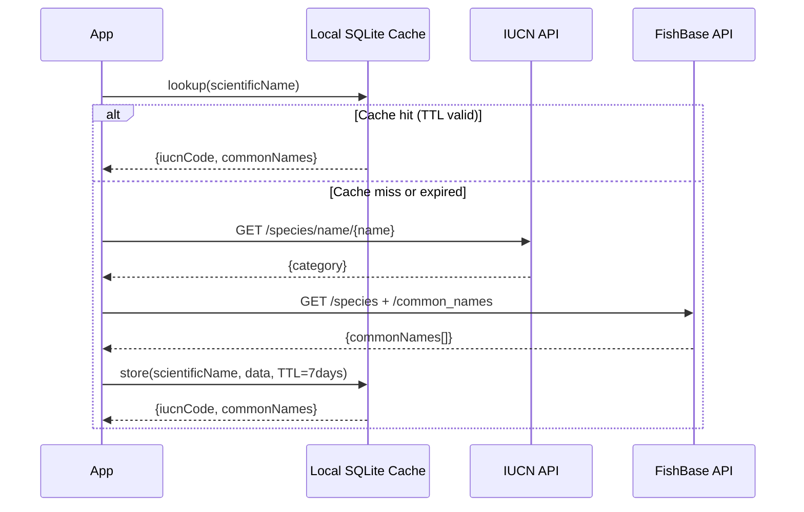

> ⚠️ **Status: Superseded by [ADR-004](./004-conservation-data-sources.md)**
> The IUCN Red List API described in this ADR is commercially prohibited for ecopal's use case.
> All conservation status data comes from Seafood Watch (primary), CITES, MSC, OSPAR, and HELCOM.
> This document is retained for historical context only. **Do not implement anything in this ADR.**

# ADR-003: Species Data Strategy (IUCN + FishBase)

**Date:** 2026-04  
**Status:** Superseded by ADR-004  
**Deciders:** Product Lead, Jarvis (AI Copilot)

---

## Context

Once a fish species is identified, the app needs two pieces of information:
1. **Conservation status** — from IUCN Red List
2. **Common names in the user's language** — from FishBase

Both are available via REST APIs, but neither is designed for real-time, per-frame mobile lookups. A caching strategy is essential.

---

## Data Sources

### IUCN Red List API
> ⚠️ **DO NOT IMPLEMENT** — Commercially restricted without written IUCN/IBAT permission.
> All implementation details have been removed. See [ADR-004](./004-conservation-data-sources.md) for approved data sources.

### FishBase REST API (rOpenSci)
- **Base URL:** `https://fishbase.ropensci.org/`
- **Auth:** None
- **Key endpoints:**
  - `GET /species?Genus=X&Species=Y` → returns `SpecCode`
  - `GET /common_names?SpecCode=N` → returns common names with `Language` and `Country` fields (300+ languages)
- **Rate limits:** Not formally documented; polite use required
- **⚠️ Reliability:** Community-maintained hosted instance; treat as best-effort. Mirror critical data locally.

### SeaLifeBase (extension)
- Same API structure as FishBase, prefix: `/sealifebase/`
- Covers marine invertebrates (shellfish, cephalopods) — relevant for future expansion

---

## Caching Strategy



**Cache TTL:** 7 days for IUCN status (conservation status changes infrequently). Common names are effectively static; cache indefinitely until app update.

**Pre-seeded cache:** The APK ships with a SQLite database pre-populated with the top 200 commercial fish species. This ensures offline capability from first launch without any API calls.

---

## Local Data Model

```sql
CREATE TABLE species_cache (
    scientific_name   TEXT PRIMARY KEY,
    iucn_code         TEXT NOT NULL,         -- LC, NT, VU, EN, CR, EW, EX, DD, NE
    fishbase_code     INTEGER,
    fetched_at        INTEGER NOT NULL,       -- Unix timestamp
    expires_at        INTEGER NOT NULL        -- Unix timestamp
);

CREATE TABLE common_names (
    scientific_name   TEXT NOT NULL,
    language_code     TEXT NOT NULL,          -- ISO 639-1 e.g. 'en', 'pt', 'es'
    common_name       TEXT NOT NULL,
    PRIMARY KEY (scientific_name, language_code)
);
```

---

## Decision

- ~~Use **IUCN Red List API** for conservation status~~ — **Superseded. Use Seafood Watch API per ADR-004.**
- Use **FishBase rOpenSci REST API** for common names, cached indefinitely per app version.
- Ship a **pre-seeded SQLite database** in the APK covering the 200 most common commercial species.
- Cache-first lookup: API only called on cache miss or TTL expiry.
- ~~**Resolve IUCN commercial licensing before app store release.**~~ — **Resolved by adopting Seafood Watch. See ADR-004.**

---

## Consequences

- A pre-seeded SQLite database must be generated as part of the build pipeline and bundled in the APK.
- The build pipeline must include a script to refresh the seed database when a new app version is released.
- IUCN API token must be stored server-side (not embedded in the app binary). For MVP, it may be proxied through a minimal backend function (e.g. a single Cloud Function / Lambda). See security NFRs.
- FishBase API availability risk is mitigated by the pre-seeded cache; the app degrades gracefully to scientific name display only if FishBase is unreachable.
