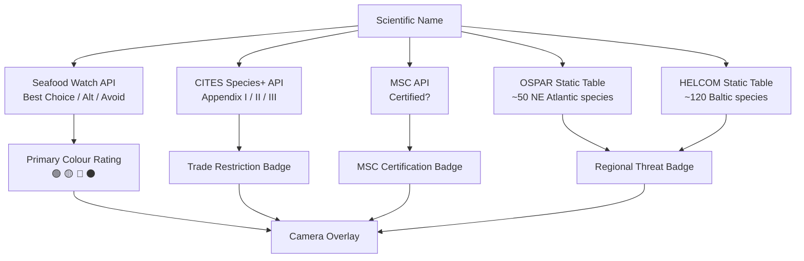

# ADR-004: Conservation Status Data Sources (Replacing IUCN as Primary)

**Date:** 2026-04  
**Status:** Accepted  
**Supersedes:** Sections of ADR-003 that referenced IUCN Red List API as primary source  
**Deciders:** Product Lead, Jarvis (AI Copilot)

---

## Context

The IUCN Red List API — originally planned as the primary conservation status source — **prohibits commercial use without written permission** from IUCN. This includes any app distributed via Google Play or the App Store, whether free or paid. The commercial licensing path runs through IBAT (Integrated Biodiversity Assessment Tool), a platform priced for corporate EIA compliance (~$5,000–$20,000/year), which is unsuitable for a consumer mobile app.

A full evaluation of 15 alternative data sources was conducted. The key finding: **almost every conservation threat classification ultimately traces back to IUCN data**, so re-serving it through GBIF, FishBase, or EOL does not resolve the licensing problem. The only truly independent alternatives with meaningful global coverage are **Seafood Watch** (own methodology, purpose-built for supermarket contexts) and the **FishBase Vulnerability Index** (own composite score, independent of IUCN).

This ADR establishes a new layered data strategy that avoids IUCN-derived data as the primary source and uses commercially viable sources for all status classifications.

---

## Decision: Layered Data Source Strategy

### Layer 1 — Primary Rating: Seafood Watch (Monterey Bay Aquarium)

| Attribute | Detail |
|---|---|
| **Source** | Monterey Bay Aquarium Seafood Watch |
| **API** | `api.seafoodwatch.org` |
| **Classification** | Best Choice → 🟢 Green \| Good Alternative → 🟡 Yellow \| Avoid → 🔴 Red \| Not rated → ⚫ Grey |
| **Coverage** | ~2,000 recommendations across hundreds of commercial species (wild + farmed) |
| **Licensing** | Non-commercial by default; **commercial license required** — contact `seafoodwatch@mbayaq.org` |
| **Why chosen** | Purpose-built for the exact use case (consumers at seafood counters). Considers stock status, management, bycatch AND ecosystem impact — more complete than IUCN alone. Consumer-friendly language. Widely recognised and trusted brand. Multiple commercial apps have already been granted licenses. |

**Action:** Contact Monterey Bay Aquarium before any commercial release. Conservation mission is a strong argument for approval.

**Fallback if refused:** Use FishBase Vulnerability Index (see Layer 1B below).

---

### Layer 1B — Fallback Primary: FishBase Vulnerability Index

Used only if Seafood Watch commercial license is refused.

| Attribute | Detail |
|---|---|
| **Source** | FishBase `Vulnerability` field (0–100 composite score) |
| **Classification** | 0–40 → 🟢 Green \| 41–65 → 🟡 Yellow \| 66–100 → 🔴 Red |
| **Coverage** | ~35,000 fish species — the world's most comprehensive fish database |
| **Licensing** | CC BY-NC; commercial use requires negotiation with FishBase directly |
| **Why fallback** | FishBase is already used for species names; the Vulnerability score is FishBase's own independent index, not sourced from IUCN. More consumer-accessible than IUCN codes. |

**Note:** The `IUCN_status` field also present in FishBase responses **must not be used** for commercial display — it is IUCN-sourced and subject to the same licensing restrictions.

---

### Layer 2 — Trade Restriction Overlay: CITES Species+

| Attribute | Detail |
|---|---|
| **Source** | CITES Species+ (UNEP-WCMC) |
| **API** | `api.speciesplus.net/api/v1/` (free token) |
| **Classification** | Appendix I → "International trade banned" \| Appendix II → "Trade regulated" \| Not listed → no badge |
| **Coverage** | ~100 fish/marine species with CITES listings |
| **Licensing** | Commercial use requires written clearance — contact `species@unep-wcmc.org` |
| **Display** | Badge overlaid on Seafood Watch colour: e.g. 🔴 + "⚠️ CITES: Trade Banned" |

---

### Layer 3 — Sustainability Certification: MSC

| Attribute | Detail |
|---|---|
| **Source** | Marine Stewardship Council Data Validation API |
| **Classification** | MSC-certified → "✅ MSC Certified" badge \| Not certified → no badge (neutral; uncertified ≠ unsustainable) |
| **Coverage** | ~600 certified fisheries globally |
| **Licensing** | Signed license agreement required with MSC |
| **Trigger** | Activated when product barcode is available (future feature); species-level check for MVP |

---

### Layer 4 — Free Regional Layers (No Permission Required)

These can be bundled in the APK immediately as static lookup tables.

| Source | Coverage | Licence | Display |
|---|---|---|---|
| **OSPAR Threatened & Declining Species list** | ~50 NE Atlantic fish species | CC BY (NERC/EMODnet) | "⚠️ OSPAR: Threatened in NE Atlantic" |
| **HELCOM Red List II (2024)** | ~120 Baltic Sea fish species | CC BY | "⚠️ HELCOM: Red-listed in Baltic Sea" |

These are static downloads embedded in the APK as lookup tables. No API calls required at runtime.

---

## Architecture Impact

---

## Data Source Comparison (Evaluated Candidates)

| Source | Own Classification | Fish Coverage | Free API | Commercial OK | Best Use |
|---|---|---|---|---|---|
| **Seafood Watch** ⭐ | ✅ Independent | ~2,000 recs | ✅ | ⚠️ License needed | **Primary rating** |
| **CITES Species+** ⭐ | ✅ Appendices | ~100 fish | ✅ | ⚠️ Contact UNEP | **Trade overlay** |
| **MSC** ⭐ | Binary certified | ~600 fisheries | ⚠️ License | ⚠️ License needed | **Sustainability badge** |
| **OSPAR** ⭐ | Binary listed | ~50 NE Atlantic | Static download | ✅ CC BY | **Regional layer** |
| **HELCOM** ⭐ | Mirrors IUCN | ~120 Baltic | Static download | ✅ CC BY | **Regional layer** |
| **IUCN Red List** | ✅ LC→EX | 15,000+ | ✅ | ❌ **Prohibited** | Do not use |
| **GBIF (IUCN endpoint)** | Re-serves IUCN | 30,000+ | ✅ | ❌ Same as IUCN | Do not use for status |
| **FishBase IUCN field** | Re-serves IUCN | 35,000+ | ✅ | ❌ IUCN terms apply | **Do not use for status** |
| **FishBase Vulnerability** | ✅ Own 0–100 | 35,000+ | ✅ | ⚠️ CC BY-NC | Fallback primary |
| **NatureServe** | ✅ G1–G5 | NA freshwater only | ✅ CC BY | ✅ | Too limited for MVP |
| **Good Fish Guide (MCS)** | ✅ 1–5 scale | ~100 UK species | ❌ No API | ⚠️ Contact MCS | UK future phase |

---

## Licensing Contact Plan

| Organisation | Contact | Priority | Arguments |
|---|---|---|---|
| Monterey Bay Aquarium (Seafood Watch) | seafoodwatch@mbayaq.org | 🔴 **Urgent — block on release** | Conservation mission; increases public exposure to their ratings; many commercial apps already approved |
| UNEP-WCMC (CITES Species+) | species@unep-wcmc.org | 🟡 High | Conservation mission; treaty data benefits from wider exposure |
| Marine Stewardship Council | msc.org/for-business | 🟡 High | Standard commercial agreement; well-established process |
| FishBase (fallback) | fishbase@leibniz-zmt.de | 🟢 Medium (only if Seafood Watch refused) | Conservation-focused app; academic collaboration potential |

---

## Consequences

- The `IUCN_status` field from FishBase API responses **must never be displayed** in the app — it is IUCN-sourced.
- The pre-seeded SQLite database (ADR-003) must store Seafood Watch ratings (not IUCN codes) as the primary status field, with CITES appendix and regional flags as separate columns.
- OSPAR and HELCOM lists must be downloaded, cleaned, and bundled as part of the build pipeline.
- The build pipeline must refresh Seafood Watch + CITES cached data on each release.
- Licensing contacts should be initiated **immediately** — before any implementation work begins on the overlay renderer.
