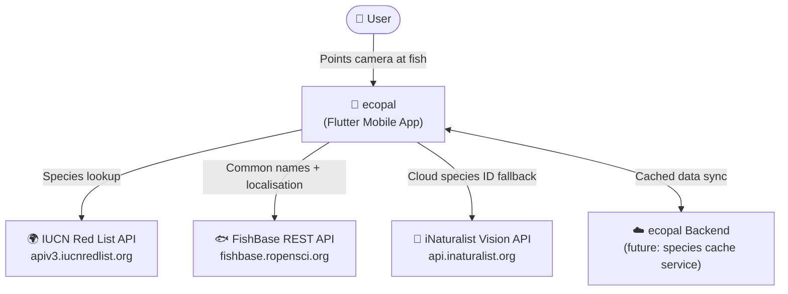
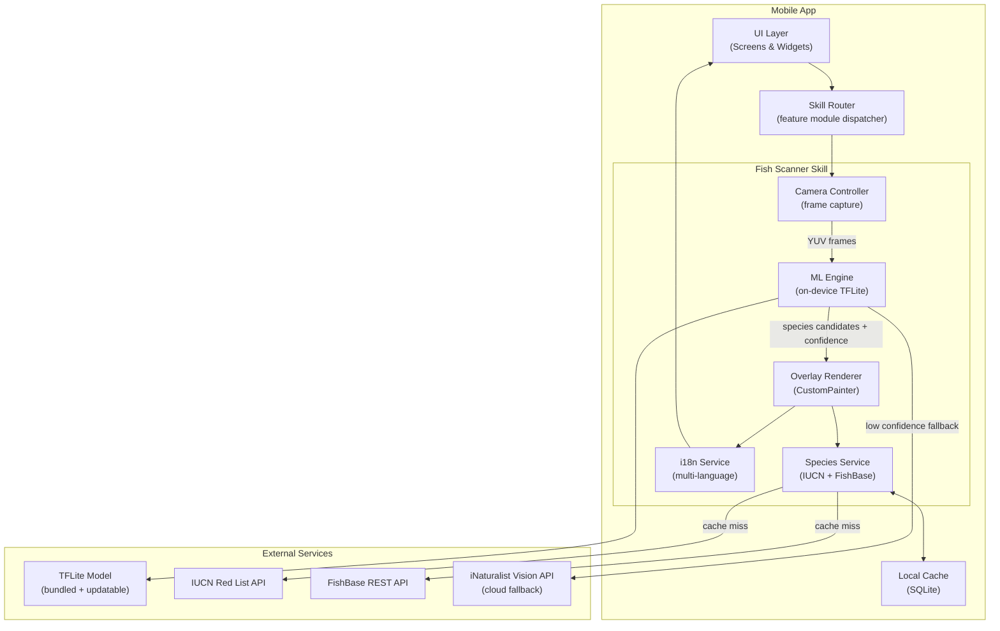
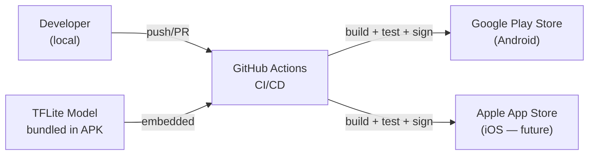
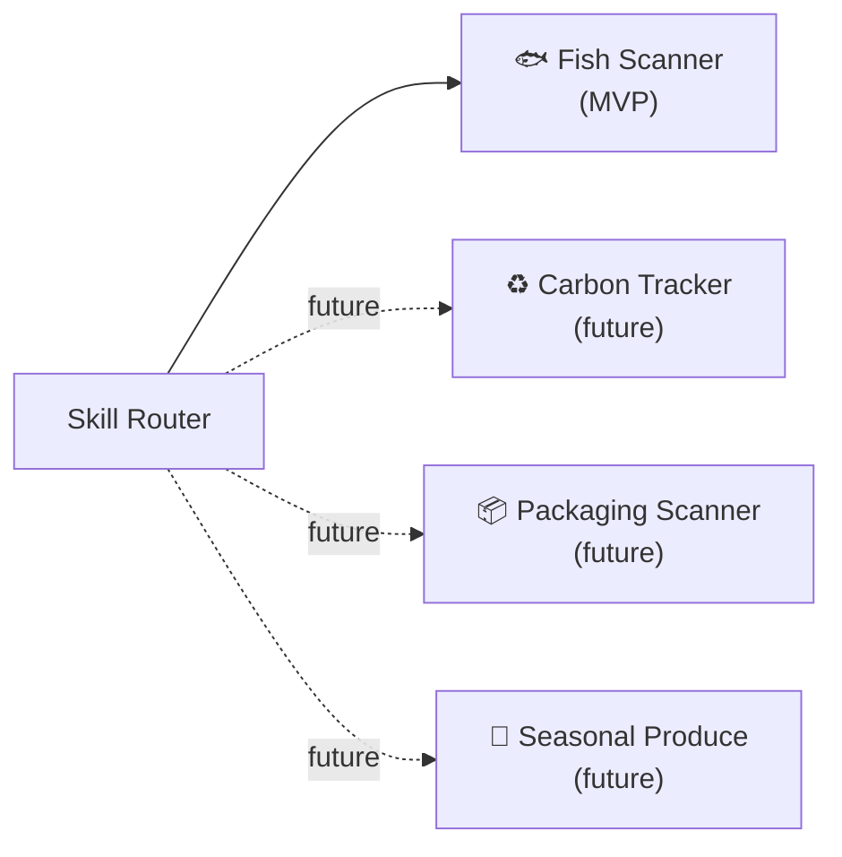

# ecopal — High-Level Architecture

> **Living document.** Updated as architectural decisions are made.  
> Last updated: 2026-04

---

## Vision

ecopal is a mobile companion app that guides users toward eco-friendly choices. Each **skill** is a self-contained feature module. The architecture is designed to support the MVP skill (Fish Scanner) while providing clean extension points for future skills (carbon footprint, packaging scanner, seasonal produce guide, etc.).

---

## System Context

---

## Application Architecture

---

## Key Architectural Principles

| Principle | Detail |
|---|---|
| **Skill-based modularity** | Each app capability is a self-contained skill module. The skill router dispatches to the correct module. Adding a new skill does not touch existing skills. |
| **Offline-first** | On-device ML model + local SQLite cache ensure core functionality works without a network connection. |
| **Privacy by design** | Camera frames are never stored or transmitted. Species lookup uses scientific name only (no image sent to IUCN/FishBase). Images are only sent to iNaturalist as an opt-in fallback when on-device confidence is low. |
| **Evolutionary design** | The backend is optional for the MVP (direct API calls from app). When usage scales, a caching proxy service is inserted without changing the mobile app's interfaces. |

---

## IUCN Colour Mapping

| IUCN Code | Category | App Colour | Meaning |
|---|---|---|---|
| `LC` | Least Concern | 🟢 Green | Safe to consume |
| `NT` | Near Threatened | 🟡 Yellow | Some concern |
| `VU` | Vulnerable | 🟡 Yellow | Some concern |
| `EN` | Endangered | 🔴 Red | Do not buy |
| `CR` | Critically Endangered | 🔴 Red | Do not buy |
| `EW` | Extinct in the Wild | 🔴 Red | Do not buy |
| `EX` | Extinct | 🔴 Red | Do not buy |
| `DD` | Data Deficient | ⚫ Grey | Insufficient data |
| `NE` | Not Evaluated | ⚫ Grey | Insufficient data |

> **Accessibility:** Colour alone is never the sole indicator. Each bounding box also displays an icon and text label (e.g. "ENDANGERED") for colour-blind users. See NFRs.

---

## Technology Decisions

| Concern | Decision | ADR |
|---|---|---|
| Mobile framework | Flutter (Android-first, iOS-ready) | [ADR-001](adr/001-cross-platform-framework.md) |
| ML inference strategy | On-device TFLite + iNaturalist cloud fallback | [ADR-002](adr/002-ml-inference-strategy.md) |
| Species data strategy | FishBase (names) + IUCN (status) + local SQLite cache | [ADR-003](adr/003-species-data-strategy.md) |

---

## Deployment Architecture (MVP)

For the MVP, the app communicates directly with IUCN and FishBase APIs. No ecopal backend is required. The backend service will be introduced when:
- API rate limits require a caching proxy
- A custom ML model serving endpoint is needed
- User accounts / preferences are added

---

## Future Skills (Architectural Extension Points)

Each skill is a Flutter feature module with its own:
- Screen(s)
- Domain services
- Local data models
- API integrations

---

## Non-Functional Requirements (System-Wide)

| Category | Requirement |
|---|---|
| **Performance** | Fish detection overlay renders within 500ms of camera frame capture |
| **Offline** | Core scanning with cached species data works with no network |
| **Battery** | Frame sampling rate throttled to conserve battery; user-adjustable |
| **Privacy** | No camera frames stored or transmitted without explicit user consent |
| **Security** | No API keys embedded in app binary; all secrets via secure backend proxy |
| **Accessibility** | WCAG 2.1 AA; colour-blind mode with icons + text (not colour alone) |
| **Localisation** | i18n from day one; common names displayed in device locale |
| **Updateability** | TFLite model updatable without full app release (remote model delivery) |
