# Feature: Fish Scanner (MVP Skill)

**Epic:** [#3 — MVP Architecture: Fish Species Scanner](https://github.com/ruimcoder/ecopal/issues/3)  
**Status:** Design  
**Last updated:** 2026-04

---

## Overview

The Fish Scanner is ecopal's MVP skill. A user points their phone camera at a fish counter (supermarket, market, fishmonger) and the app identifies fish species in real time. Each identified fish is highlighted with a colour-coded bounding box indicating its Seafood Watch sustainability rating, along with its scientific name, common name (in the user's language), and threat level label.

---

## User Story

> **As** a conscious consumer,  
> **I want** to point my phone camera at a fish display  
> **So that** I can instantly see which fish are endangered and make an informed buying decision.

---

## Functional Requirements

### FR-01: Real-time camera preview
- The app displays a live full-screen camera preview.
- The preview targets 30fps on modern Android devices.
- The user can switch between front and rear camera (rear is default and primary).

### FR-02: Fish species detection
- The app samples camera frames at **5fps** for ML inference.
- The on-device TFLite model identifies fish species and returns:
  - Scientific name (e.g. *Thunnus thynnus*)
  - Confidence score (0.0–1.0)
  - Bounding box coordinates (normalised 0.0–1.0)
- Species below **0.75 confidence** trigger a cloud fallback (iNaturalist API) if network is available.
- Non-fish objects are ignored (confidence filter + taxon filter).

### FR-03: Conservation status overlay
Each detected fish renders a bounding box with:

| Element | Detail |
|---|---|
| **Box border colour** | Primary rating colour (see table below) |
| **Box fill** | Colour at 20% opacity |
| **Label: Scientific name** | Italic, small font, top of box |
| **Label: Common name** | Bold, medium font, below scientific name; localised to device language |
| **Label: Rating** | Consumer-friendly text (e.g. "AVOID" / "GOOD ALTERNATIVE" / "BEST CHOICE"); colour matches box |
| **Icon** | Accessibility icon (⚠️ / ✅ / ❓) — not colour-only |
| **Badges (optional)** | CITES trade badge, MSC certification badge, OSPAR/HELCOM regional badge |

#### Primary Rating Colour Reference (Seafood Watch)

| Rating | Colour | Hex | Meaning |
|---|---|---|---|
| Best Choice | 🟢 Green | `#4CAF50` | Well managed, low environmental impact |
| Good Alternative | 🟡 Amber | `#FFC107` | Some concerns — buy less often |
| Avoid | 🔴 Red | `#F44336` | Overfished or caught/farmed in harmful ways |
| Not Rated | ⚫ Grey | `#9E9E9E` | Insufficient data for this species |

> **Data source:** Seafood Watch (Monterey Bay Aquarium) — commercial license required before release.  
> **Fallback:** FishBase Vulnerability Index (0–100) if Seafood Watch license is refused.  
> **Do NOT use:** IUCN Red List API, GBIF IUCN endpoint, or FishBase `IUCN_status` field — all are commercially restricted.  
> See [ADR-004](../adr/004-conservation-data-sources.md) for full rationale.

### FR-04: Multi-language support
- Common names displayed in the **device locale language** (ISO 639-1).
- Fallback chain: device locale → English → scientific name only.
- UI strings (threat level labels, status text) localised via Flutter's `flutter_localizations`.
- Initial supported languages: **English, Portuguese, Spanish, French, German**.

### FR-05: Species detail panel
- Tapping a bounding box opens a **bottom sheet** with:
  - Full species name (scientific + common)
  - Seafood Watch rating with full category name
  - Brief ecology note (e.g. habitat, region)
  - Link to Seafood Watch species page
  - "Why this matters" section (1–2 sentences; ecologically grounded)

### FR-06: Offline mode
- The app ships with a pre-seeded SQLite database of the **200 most common commercial fish species**.
- Core scanning and overlay works fully offline.
- A non-intrusive banner indicates "offline mode — limited species coverage" when network is unavailable.

### FR-07: Sharing
- User can capture a screenshot with overlays and share it via the native share sheet.
- Screenshot includes the ecopal watermark and a link to download the app.

---

## Non-Functional Requirements

### Performance
| Metric | Target |
|---|---|
| Overlay render latency (on-device) | < 500ms from frame capture |
| Overlay render latency (cloud fallback) | < 2500ms |
| App cold start time | < 3 seconds |
| Frame inference rate | 5fps (preview continues at 30fps) |
| TFLite model size | < 20MB |
| Pre-seeded SQLite DB size | < 5MB |

### Battery
- ML inference runs only while the Fish Scanner screen is **active and foregrounded**.
- Frame sampling pauses when app is backgrounded.
- Inference uses GPU delegate (energy-efficient) with CPU fallback.
- Frame sampling rate exposed as a user setting (3/5/10 fps).

### Privacy & Security
| Requirement | Implementation |
|---|---|
| Camera frames not stored | Frames processed in memory only; never written to disk |
| Cloud fallback opt-in | User explicitly consents to sending cropped images to iNaturalist in onboarding |
| No API keys in binary | Seafood Watch API key proxied via a minimal backend function (Cloud Function / Supabase Edge Function) |
| No user tracking by default | No analytics without explicit opt-in |
| HTTPS only | Certificate pinning for ecopal backend endpoints |
| Seafood Watch commercial licence | Must be obtained before any commercial app store release |

### Accessibility
- Bounding boxes use both **colour AND icon AND text** — never colour alone.
- Minimum tap target: 44×44dp for bounding box interactions.
- Supports Android TalkBack (screen reader labels on all overlay elements).
- Colour-blind mode toggle in settings: replaces colour with high-contrast patterns + text badges.

### Quality Gates
| Gate | Threshold |
|---|---|
| Unit test coverage | ≥ 80% on domain logic (services, models) |
| Integration tests | All API adapters tested with mock HTTP responses |
| Widget tests | Overlay renderer tested with known bounding box inputs |
| Performance test | P95 inference time < 500ms on a mid-range device (2019 era) |
| Accessibility audit | No WCAG 2.1 AA violations on the Scanner screen |
| No API keys in binary | Enforced by secret scanning in CI |

---

## Architecture

```mermaid
flowchart TD
    A[CameraPreview Widget] -->|YUV frames @ 5fps| B[FishDetectionService\n- Dart Isolate\n- TFLite inference]
    B -->|confidence ≥ 0.75| C[SpeciesLookupService]
    B -->|confidence < 0.75 + network| D[iNaturalistAdapter\ncloud fallback]
    D --> C
    C -->|cache miss| E[SeafoodWatchAdapter]
    C -->|cache miss| F[FishBaseAdapter]
    E --> G[(SQLite Cache)]
    F --> G
    G --> C
    C -->|DetectionResult| H[OverlayRenderer\nCustomPainter]
    H -->|draws on| A
    H --> I[I18nService\ncommon name lookup]
```



### Key Classes / Interfaces

```
lib/
  features/
    fish_scanner/
      screens/
        fish_scanner_screen.dart      # Main screen, CameraPreview + overlay stack
      widgets/
        fish_overlay_painter.dart     # CustomPainter for bounding boxes
        species_detail_sheet.dart     # Bottom sheet on tap
      services/
        fish_detection_service.dart   # TFLite inference + iNat fallback
        species_lookup_service.dart   # Cache + Seafood Watch + FishBase orchestration
        i18n_service.dart             # Common name localisation
      adapters/
        seafood_watch_adapter.dart    # Seafood Watch REST API client
        fishbase_adapter.dart         # FishBase REST API client
        inaturalist_adapter.dart      # iNaturalist Vision API client
      models/
        detection_result.dart         # Bounding box + species + confidence
        species_info.dart             # Scientific name + IUCN code + common names
        iucn_category.dart            # Enum with colour + label + icon
      data/
        species_db.dart               # SQLite access layer
        seed/
          species_seed.db             # Pre-seeded SQLite (bundled asset)
```

---

## Data Models

### `DetectionResult`
```dart
class DetectionResult {
  final String scientificName;
  final double confidence;
  final Rect boundingBox;         // normalised 0.0–1.0
  final SpeciesInfo? speciesInfo; // null while lookup in progress
}
```

### `SpeciesInfo`
```dart
class SpeciesInfo {
  final String scientificName;
  final IucnCategory iucnCategory;
  final Map<String, String> commonNames; // ISO 639-1 code → name
  final int? fishbaseCode;
}
```

### `IucnCategory` (enum)
```dart
enum IucnCategory {
  lc, nt, vu, en, cr, ew, ex, dd, ne;

  Color get colour => switch(this) {
    lc                    => const Color(0xFF4CAF50),
    nt || vu              => const Color(0xFFFFC107),
    en || cr || ew || ex  => const Color(0xFFF44336),
    _                     => const Color(0xFF9E9E9E),
  };

  String get label => switch(this) {
    lc  => 'LEAST CONCERN',
    nt  => 'NEAR THREATENED',
    vu  => 'VULNERABLE',
    en  => 'ENDANGERED',
    cr  => 'CRITICALLY ENDANGERED',
    ew  => 'EXTINCT IN THE WILD',
    ex  => 'EXTINCT',
    dd  => 'DATA DEFICIENT',
    ne  => 'NOT EVALUATED',
  };
}
```

---

## API Contracts

> Conservation data is sourced from Seafood Watch API — see [ADR-004](../adr/004-conservation-data-sources.md) for full contract.

### FishBase Common Names
```
GET https://fishbase.ropensci.org/species?Genus={genus}&Species={species}
→ { data: [{ SpecCode: 144, ... }] }

GET https://fishbase.ropensci.org/common_names?SpecCode={code}
→ { data: [{ ComName: "Atlantic Bluefin Tuna", Language: "English", ... }] }
```

### iNaturalist Vision (cloud fallback)
```
POST https://api.inaturalist.org/v1/computervision/score_image
Content-Type: multipart/form-data
Body: { image: <cropped fish frame> }
→ { results: [{ taxon: { name, iconic_taxon_name }, score }] }
Filter: iconic_taxon_name === "Actinopterygii"
```

---

## Open Questions / Risks

| # | Risk | Severity | Mitigation |
|---|---|---|---|
| 1 | Seafood Watch commercial license refused | 🔴 High | Use FishBase Vulnerability Index as fallback; contact MBA early with conservation mission argument |
| 2 | On-device model accuracy for dead/processed fish | 🔴 High | Collect supermarket-specific training data; budget for data labelling |
| 3 | CITES commercial clearance refused | 🟡 Medium | Use OSPAR/HELCOM static lists (CC BY) as free regional fallback; accept narrower coverage |
| 4 | iNaturalist `score_image` is undocumented; may change | 🟡 Medium | Monitor; fallback gracefully to "unknown"; investigate official alternatives |
| 5 | FishBase rOpenSci instance reliability | 🟡 Medium | Pre-seeded cache mitigates; monitor uptime |
| 6 | Model size impact on APK size | 🟢 Low | Use Play Asset Delivery if model exceeds 20MB |
| 7 | **DO NOT USE: IUCN Red List API / GBIF IUCN endpoint / FishBase `IUCN_status` field** | 🔴 Legal | Prohibited for commercial use without expensive IBAT subscription. See ADR-004 |

---

## Implementation Issues

See GitHub milestone **MVP - Fish Scanner**:
- [ ] [Flutter project scaffold](#) *(issue to be created)*
- [ ] [Camera integration + frame capture](#) *(issue to be created)*
- [ ] [TFLite model integration + inference isolate](#) *(issue to be created)*
- [ ] [Species overlay renderer (CustomPainter)](#) *(issue to be created)*
- [ ] [Seafood Watch API adapter + SQLite cache](#) *(issue to be created)*
- [ ] [FishBase API adapter + common names](#) *(issue to be created)*
- [ ] [Pre-seeded species database (build pipeline)](#) *(issue to be created)*
- [ ] [Multi-language / i18n setup](#) *(issue to be created)*
- [ ] [iNaturalist cloud fallback adapter](#) *(issue to be created)*
- [ ] [Species detail bottom sheet](#) *(issue to be created)*
- [ ] [Accessibility: colour-blind mode + TalkBack](#) *(issue to be created)*
- [ ] [Security: API key proxy (Cloud Function)](#) *(issue to be created)*
- [ ] [CI/CD pipeline: build + test + sign + deploy](#) *(issue to be created)*
